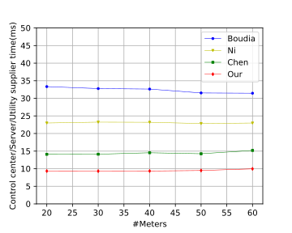
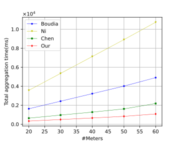

# Circle Aggregation

## Prepare

### Java

- Open-JDK 11
- Maven

### Platform

- Linux or Windows 10
- 4G RasberryPi 4B

## Compile

``` bash
    git clone https://github.com/SevenBruce/CirAggregation.git
    mvn clean package
```

## Experiments

### Comparision with other methods

#### Linux

``` bash
bash experiments.sh
```

#### Win10

``` bash
experiments.bat
```

### Results

#### Registration

 

### Aggregation

 

 

### K

 

### Range


